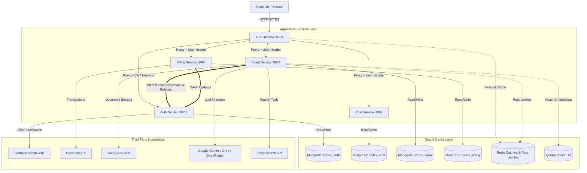
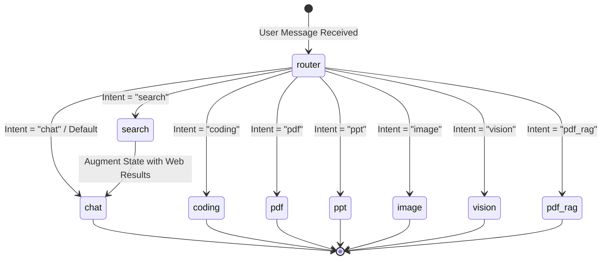

# Cortex AI — Enterprise Multi-Agent Microservices Platform

Cortex AI is an advanced, production-grade artificial intelligence platform built on a decentralized microservices architecture. It features a sophisticated multi-agent orchestration system powered by **LangGraph.js** to coordinate and route task execution among specialized AI agents. 

The frontend provides a rich, responsive interface with features like real-time streaming, interactive code workspace previews (using Vite-style sandboxed previews), slide presentation generation, and PDF document retrieval-augmented generation (RAG).

---

## Table of Contents

- [System Architecture](#system-architecture)
- [Tech Stack](#tech-stack)
- [Agent Orchestration (LangGraph.js)](#agent-orchestration-langgraphjs)
  - [Worker Agents](#worker-agents)
  - [State & Routing Graph](#state--routing-graph)
  - [Credit Deduction & Fault-Tolerant Refunds](#credit-deduction--fault-tolerant-refunds)
  - [Redis Rate Limiting](#redis-rate-limiting)
- [Service Boundaries](#service-boundaries)
- [Database & Storage Topology](#database--storage-topology)
- [Environment Configuration](#environment-configuration)
  - [Root Configuration (Docker Compose)](#root-configuration-docker-compose)
  - [Gateway Service](#gateway-service)
  - [Auth Service](#auth-service)
  - [Chat Service](#chat-service)
  - [Billing Service](#billing-service)
  - [Agent Service](#agent-service)
  - [Frontend Client](#frontend-client)
- [Getting Started](#getting-started)
  - [Quickstart with Docker Compose (Recommended)](#quickstart-with-docker-compose-recommended)
  - [Manual Local Development](#manual-local-development)
- [Test Suite & Verification](#test-suite--verification)
- [Mock Development Modes](#mock-development-modes)

---

## System Architecture

The platform is designed around a secure API Gateway that routes traffic to specialized services. Communication between services is secured via shared secret authentication for internal APIs, while public-facing client requests are authenticated using Firebase tokens resolved against a high-performance Redis cache.



---

## Tech Stack

### Frontend Client
*   **Framework:** React 19 (Vite)
*   **State Management:** Redux Toolkit (`@reduxjs/toolkit` & `react-redux`)
*   **Styling:** Tailwind CSS v4 & Framer Motion (micro-animations)
*   **Rich Text & Rendering:** `react-markdown` with code highlighting (`react-syntax-highlighter`) and Math/GFM plugins.
*   **Interactive Workspace:** Monaco Editor (`@monaco-editor/react`) for viewing and reviewing code.
*   **Authentication:** Firebase Auth SDK.

### Backend Microservices
*   **Runtime:** Node.js (ES Modules syntax)
*   **Framework:** Express.js (v5.2+)
*   **Database ORM:** Mongoose (MongoDB 7.0+)
*   **Orchestration Engine:** `@langchain/langgraph` (v1.4.4)
*   **Caching & Coordination:** `ioredis` (Redis 7.0+)
*   **Vector Search Database:** `@langchain/qdrant` & Qdrant Engine
*   **External Generators:** `pptxgenjs` (PowerPoint generation), `pdfkit` (PDF rendering), `pdf-parse` (metadata extraction).

---

## Agent Orchestration (LangGraph.js)

The platform leverages LangGraph.js to model AI interactions as a stateful, cyclic directed graph. A central **Supervisor Router** acts as the orchestrator, detecting user intent and routing the message to one of several specialized worker nodes.

### Worker Agents

| Worker Node | Primary LLM Provider | Specialized Library/Tool | Intent / Capability |
| :--- | :--- | :--- | :--- |
| **`chat`** | Groq (Llama 3.3 70b) | LangChain Chat Prompt | General conversation and basic Q&A. |
| **`coding`** | OpenRouter (DeepSeek Chat) | Monaco Editor Support | Code generation, code review, optimization, debugging, and language conversion. Generates structural multi-file code previews. |
| **`search`** | Groq (Llama 3.3 70b) | Tavily / LangChain Tavily | Dynamic web search querying to fetch real-time external data. |
| **`pdf`** | Groq (Llama 3.3 70b) | `pdfkit` / Express Uploads | Generating stylized downloadable PDF documents. |
| **`pdf_rag`** | Groq (Llama 3.3 70b) | Qdrant Vector DB / `pdf-parse` | Uploading PDFs, parsing layout/text, embedding chunks, and performing Semantic Q&A. |
| **`ppt`** | Groq (Llama 3.3 70b) | `pptxgenjs` / AWS S3 | Automatic slide layout design, styling, text fitting, S3 storage, and generating presigned download URLs. |
| **`vision`** | Google Gemini (2.5 Flash) | Google Gen AI SDK | Multimodal vision analysis supporting image uploads and queries. |
| **`image`** | Groq (Llama 3.3 70b) | Custom Image APIs | Dynamic text-to-image prompting and generation. |

### State & Routing Graph

The supervisor graph starts at the `router` node, which parses user inputs, detects the desired tool/agent, and redirects. 



### Credit Deduction & Fault-Tolerant Refunds

To monetize agent usage, Cortex AI implements a transactional credit deduction system:
1.  **Deduction:** Before a worker agent runs, the system calls `/internal/deduct-credits` on the Auth service via secure service-to-service communication.
2.  **Validation:** If the user has insufficient credits, the graph throws a `402 Payment Required` or `Insufficient Credits` exception, halting agent execution.
3.  **Fault-Tolerant Refund:** If credit deduction succeeds but agent execution subsequently crashes (e.g. LLM rate limit, network failure, file generation crash), the system catches the error, calls `/internal/refund-credits`, and restores the user's credits.

### Redis Rate Limiting

To protect backend resources and LLM API quotas, each agent configuration defines a sliding-window rate limit stored in Redis:
*   **Limits:** Chat: 20 req/min, Coding: 5 req/min, Search: 5 req/min, PDF: 5 req/min, PPT: 5 req/min, Image: 3 req/min.
*   **Implementation:** Leverages Redis atomic `INCR` and `EXPIRE` operations. If a user exceeds the threshold, the service yields a `429 Too Many Requests` status, indicating the exact remaining cooldown duration (`retryAfter`).

---

## Service Boundaries

### 1. API Gateway (`gateway`)
*   Serves as the single client entry point (Port `8000`).
*   Configures system CORS policies, HTTP headers (Helmet), and request logging (Morgan).
*   Validates public session cookies/JWT tokens using the shared Redis database.
*   Blocks public access to service-to-service internal pathways (e.g. rejects direct requests to `/api/auth/internal/*`).
*   Proxies valid requests down to individual microservices via `express-http-proxy`, injecting user identity headers (`x-user-id`, `x-user-email`).

### 2. Authentication Service (`auth`)
*   Maintains user accounts and structures (MongoDB `cortex_auth`).
*   Integrates with Firebase Admin SDK to verify Google Sign-In identity tokens.
*   Exposes internal routes (`/internal/deduct-credits`, `/internal/refund-credits`) guarded by a shared cryptographic secret (`INTERNAL_SERVICE_SECRET`).
*   Tracks available token credits and account state.

### 3. Chat Service (`chat`)
*   Manages user conversations, sessions, and messages (MongoDB `cortex_chat`).
*   Allows creating, naming, deleting, and fetching message threads.

### 4. Billing Service (`billing`)
*   Processes premium plan transactions and credit top-ups.
*   Integrates with **Razorpay** to generate payments orders (`/create-order`) and verify webhook/checkout cryptographic signatures (`/verify-payment`).
*   Stores ledger transaction receipts in MongoDB `cortex_billing`.

### 5. Agent Service (`agent`)
*   The primary runtime engine (Port `8003`).
*   Initializes the LangGraph workflows, coordinates worker agents, and runs local rate checks.
*   Integrates with third-party APIs (Tavily, Gemini, Groq, OpenRouter).
*   Manages binary asset generation, S3 storage uploads, and vector embedding pipelines.

---

## Database & Storage Topology

1.  **MongoDB:** Independent databases are used per microservice:
    *   `cortex_auth`: Collections for `users`.
    *   `cortex_chat`: Collections for `threads` and `messages`.
    *   `cortex_agent`: Metadata about generated files, slides, and sessions.
    *   `cortex_billing`: Ledger transaction documents (`payments`).
2.  **Redis:** 
    *   Authentication cache (session mappings).
    *   Sliding-window agent rate limits.
3.  **Qdrant:** Vector Database. Segregates semantic text splits into target vector collections, enabling highly optimized similarity matching for PDF RAG tasks.
4.  **AWS S3:** Serves as the binary target directory for compiled presentations (`.pptx`) and generated files. Files are retrieved through transient presigned URLs for strict access security.

---

## Environment Configuration

Copy the respective `.env.example` files to `.env` in the root directories of the services before executing.

### Root Configuration (Docker Compose)
A master `.env` in the root workspace configuration manages general setup:
```ini
# No root environment variables are strictly required if using default docker-compose port mappings, 
# but service-level `.env` files must be populated.
```

### Gateway Service (`backend/gateway/.env`)
| Variable | Default Value | Description |
| :--- | :--- | :--- |
| `PORT` | `8000` | The public-facing entry point port. |
| `REDIS_URL` | `redis://localhost:6379` | Connection URI for the Redis cache. |
| `AUTH_SERVICE` | `http://localhost:8001` | Internal URL of the Auth Service. |
| `CHAT_SERVICE` | `http://localhost:8002` | Internal URL of the Chat Service. |
| `AGENT_SERVICE` | `http://localhost:8003` | Internal URL of the Agent Service. |
| `BILLING_SERVICE` | `http://localhost:8004` | Internal URL of the Billing Service. |

### Auth Service (`backend/services/auth/.env`)
| Variable | Default Value | Description |
| :--- | :--- | :--- |
| `PORT` | `8001` | Service execution port. |
| `MONGODB_URL` | `mongodb://localhost:27017/cortex_auth` | Database connection URI. |
| `FRONTEND_URL` | `http://localhost:5173` | Target URL of the frontend (for CORS validation). |
| `INTERNAL_SERVICE_SECRET` | `your_shared_internal_secret_here` | Secret key shared among microservices for auth verification. |

### Chat Service (`backend/services/chat/.env`)
| Variable | Default Value | Description |
| :--- | :--- | :--- |
| `PORT` | `8002` | Service execution port. |
| `MONGODB_URL` | `mongodb://localhost:27017/cortex_chat` | Database connection URI. |

### Billing Service (`backend/services/billing/.env`)
| Variable | Default Value | Description |
| :--- | :--- | :--- |
| `PORT` | `8004` | Service execution port. |
| `MONGODB_URL` | `mongodb://localhost:27017/cortex_billing` | Database connection URI. |
| `AUTH_SERVICE` | `http://localhost:8001` | Internal URL of the Auth Service. |
| `RAZORPAY_KEY_ID` | `your_razorpay_key_id` | Razorpay Dashboard Public Key. |
| `RAZORPAY_KEY_SECRET` | `your_razorpay_key_secret` | Razorpay Dashboard Secret. |
| `INTERNAL_SERVICE_SECRET` | `your_shared_internal_secret_here` | Secret key shared among microservices for auth verification. |

### Agent Service (`backend/services/agent/.env`)
| Variable | Default/Example Value | Description |
| :--- | :--- | :--- |
| `PORT` | `8003` | Service execution port. |
| `MONGODB_URL` | `mongodb://localhost:27017/cortex_agent` | Database connection URI. |
| `CHAT_SERVICE` | `http://localhost:8002` | Internal URL of the Chat Service. |
| `AUTH_SERVICE` | `http://localhost:8001` | Internal URL of the Auth Service. |
| `GATEWAY_URL` | `http://localhost:8000` | Public URL of the API Gateway. |
| `GOOGLE_API_KEY` | `your_google_gemini_api_key` | API Key for Gemini 2.5 models. |
| `GROQ_API_KEY` | `your_groq_api_key` | API Key for Llama models. |
| `OPENROUTER_API_KEY` | `your_openrouter_api_key` | API Key for OpenRouter (DeepSeek model). |
| `TAVILY_API_KEY` | `your_tavily_api_key` | Search token for Tavily search engine. |
| `AWS_ACCESS_KEY_ID` | `your_aws_access_key_id` | AWS S3 credentials key. |
| `AWS_SECRET_ACCESS_KEY`| `your_aws_secret_access_key` | AWS S3 credentials secret. |
| `AWS_REGION` | `ap-south-1` | Target AWS S3 Region. |
| `AWS_BUCKET_NAME` | `your_aws_bucket_name` | Target Bucket for file/asset storage. |
| `QDRANT_URL` | `http://localhost:6333` | Connection endpoint for Qdrant. |
| `QDRANT_API_KEY` | `your_qdrant_api_key` | Access token for the vector database. |
| `INTERNAL_SERVICE_SECRET`| `your_shared_internal_secret_here` | Secret key shared among microservices. |

### Frontend Client (`frontend/.env`)
| Variable | Default Value | Description |
| :--- | :--- | :--- |
| `VITE_FIREBASE_API_KEY` | `your_firebase_api_key` | Firebase Web configuration API key. |
| `VITE_SERVER_URL` | `http://localhost:8000` | Target endpoint mapping to the API Gateway. |
| `VITE_RAZORPAY_KEY` | `your_razorpay_key_id` | Razorpay Client Public key. |

---

## Getting Started

### Quickstart with Docker Compose (Recommended)

Cortex AI defines a unified configuration in the root directory. To bootstrap the infrastructure containers (MongoDB, Redis, Qdrant) along with all five microservices and the Vite hot-reloading dev client, execute:

```bash
# Clone the repository and transition into it
cd cortex-ai-fixed

# Fire up all services
docker-compose up --build
```

*   **Vite Client Development Server:** Available at [http://localhost:5173](http://localhost:5173)
*   **API Gateway:** Listens on [http://localhost:8000](http://localhost:8000)
*   **Databases:** MongoDB (Port `27017`), Redis (Port `6379`), Qdrant Console (Port `6333`)

### Manual Local Development

If you prefer to run services individually without Docker virtualization:

#### 1. Setup Infrastructure
Ensure you have running instances of MongoDB, Redis, and Qdrant locally.

#### 2. Run the Backend Gateway and Services
For each directory, install dependencies and run:

```bash
# In separate terminal windows for gateway, services/auth, services/chat, services/billing, services/agent:
npm install
npm run dev # or npm start
```

#### 3. Run the Frontend Client
```bash
cd frontend
npm install
npm run dev
```

---

## Test Suite & Verification

Cortex AI features automated unit and integration tests written using the Node.js native test runner (`node --test`). 

### Running Tests

To run tests in a specific service, navigate to the target directory and run the test script:

```bash
# Agent Service Tests
cd backend/services/agent
npm test

# Auth Service Tests
cd backend/services/auth
npm test

# Billing Service Tests
cd backend/services/billing
npm test

# Frontend Client Utility Tests
cd frontend
npm test
```

*   **Agent Service Tests (`backend/services/agent/tests`)**
    *   `deductCredits.test.js`: Validates the deduct/refund Axios transaction handlers.
    *   `multer.test.js`: Confirms file parsing and form-data uploads.
    *   `router.node.test.js`: Verifies the LangGraph supervisor routes intents accurately.
*   **Auth Service Tests (`backend/services/auth/tests`)**
    *   `agentCost.test.js`: Tests user schema updates and transactional debit thresholds.
    *   `internal.middleware.test.js`: Validates shared secret authorization headers.
*   **Billing Service Tests (`backend/services/billing/tests`)**
    *   `verifySignature.test.js`: Confirms Razorpay signature verification logic under different payloads.

---

## Mock Development Modes

Cortex AI includes built-in mock configurations to allow immediate local development and validation without requiring active paid API credentials.

### 1. Google Login Bypass (Auth Service)
If the frontend variable `VITE_FIREBASE_API_KEY` is undefined or contains the value `"your_firebase_api_key"` (or starts with `"add "`/`"Add "`), the system runs in **Mock Mode**:
*   The login window will bypass the Firebase pop-up and Google Auth provider.
*   It generates a mock token (`mock-firebase-uid`), creating or signing in a mock user inside the database automatically.

### 2. Simulated LLM Responses (Agent Service)
If the agent detects that target API keys (`GOOGLE_API_KEY`, `GROQ_API_KEY`, `OPENROUTER_API_KEY`) are missing, default placeholders, or prefixed with `"add "`/`"Add "`, the LangGraph nodes wrap responses:
*   **Router Node:** Automatically parses standard strings (e.g. if the message contains `"code"` or `"program"`, it routes to the coding agent; if it contains `"pdf"`, it routes to the PDF agent).
*   **Worker Nodes:** Instead of raising credential errors, they return detailed, simulated markdown responses identifying the model name and mock status. This facilitates end-to-end interface testing.
